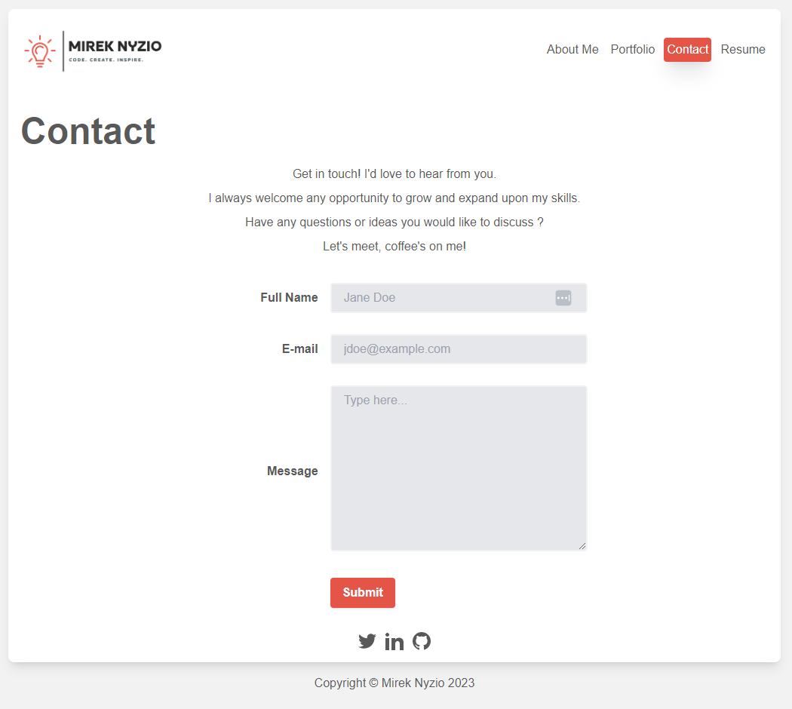

# REACT PORTFOLIO

## Description

Web developer portfolio built using React which showcases my skills and built projects.
This is a fully responsive single page client side application which utilized 
'framer motion' package for animations.

- [REACT PORTFOLIO](#react-portfolio)
  - [Description](#description)
  - [Installation](#installation)
    - [Link to GitHub Repo](#link-to-github-repo)
    - [Link to deployed application](#link-to-deployed-application)
    - [`npm start`](#npm-start)
    - [`npm run build`](#npm-run-build)
    - [`npm run deploy`](#npm-run-deploy)
  - [Mock-up](#mock-up)
    - [About](#about)
    - [Portfolio](#portfolio)
    - [Contact](#contact)
    - [Resume](#resume)
  - [Contributors](#contributors)
  - [License:](#license)
  - [Questions](#questions)
    - [GitHub](#github)
    - [e-mail](#e-mail)

## Installation

### Link to GitHub Repo

[https://github.com/mnyzio/react-portfolio](https://github.com/mnyzio/react-portfolio)

### Link to deployed application

[https://mnyzio.github.io/react-portfolio/](https://mnyzio.github.io/react-portfolio/)

### `npm start`

Runs the app in the development mode.\
Open [http://localhost:3000](http://localhost:3000) to view it in your browser.

The page will reload when you make changes.\
You may also see any lint errors in the console.

### `npm run build`

Builds the app for production to the `build` folder.\
It correctly bundles React in production mode and optimizes the build for the best performance.

The build is minified and the filenames include the hashes.\
Your app is ready to be deployed!

### `npm run deploy`

Builds the app for production to the `build` folder.\
Depolyes build to gh-pages.\
`*` make sure `homepage` is set to your github repo prior to deployment

## Mock-up

### About

### Portfolio

### Contact

### Resume

## Contributors

Mirek Nyzio

## License:

MIT License

## Questions

### GitHub

[www.github.com/mnyzio](www.github.com/mnyzio)

### e-mail

[m.nyzio@outlook.com](m.nyzio@outlook.com)